# Networking

Este repositorio contiene ejercicios prácticos que exploran las capacidades de red que ofrece Java, incluyendo el uso de URL, Sockets, Datagramas (UDP) y RMI (Remote Method Invocation). Cada ejercicio demuestra cómo establecer comunicación entre procesos distribuidos, ya sea mediante protocolos de bajo nivel como TCP/UDP o utilizando abstracciones de más alto nivel como RMI.

### Socket y ServerSocket (TCP)
Usados para establecer una comunicación orientada a conexión. El cliente crea un Socket hacia el servidor, que escucha con un ServerSocket. 

### DatagramSocket y DatagramPacket (UDP)
Proporcionan una forma de enviar y recibir datos sin conexión establecida (protocolo no orientado a conexión). Es rápido, pero sin garantías de entrega.
### RMI (Remote Method Invocation)
Permite invocar métodos de objetos ubicados en otras máquinas (Java-to-Java) como si fueran locales. Usa serialización de objetos y un registro RMI para ubicar servicios.
## Prerrequisitos
Java 17+

Maven 3.8+

Git 

# EJERCICIO 1
Escriba un programa en el cual usted cree un objeto URL e imprima en
pantalla cada uno de los datos que retornan los 8 métodos de la sección anterior.
Ubicado en la carpeta de exercise1, usamos la URL: https://github.com/Daniel-Aldana10/.

Resultado:

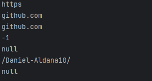

# EJERCICIO 2
Escriba una aplicación browser que pregunte una dirección URL al usuario
y que lea datos de esa dirección y que los almacene en un archivo con el nombre
resultado.html.
Luego intente ver este archivo en el navegador.

La implementacion se encuentra ubicada en la carpeta de exercise2, para ejecutarla usamos el comando mvn spring-boot:run

Luego nos vamos al browser e indicamos localhost:8080/index.html y veremos la pagina, ponemos en el espacio indicado la url

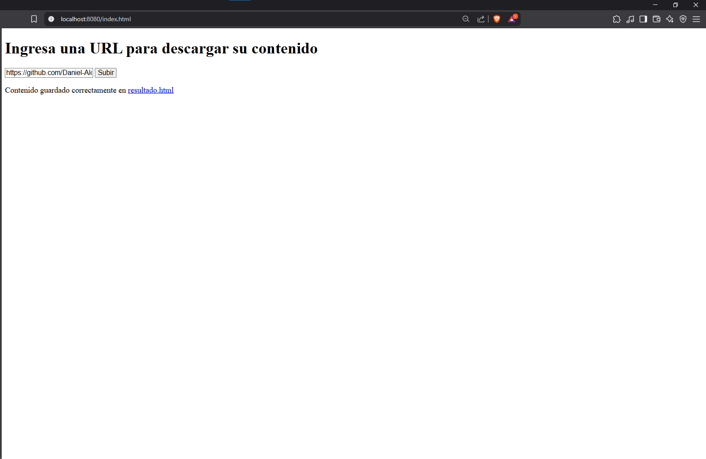

Luego nos dirigimos al html generado y vemos el resultado

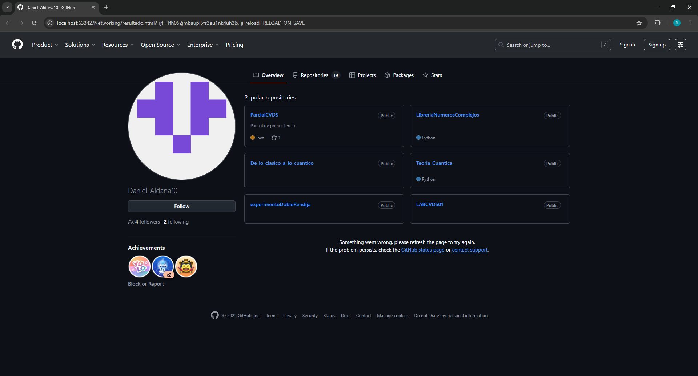

# Ejercicio 3

Escriba un servidor que reciba un n´umero y responda el cuadrado de este
número.

La implementacion se encuentra ubicada en la carpeta de exercise3, para ejecutarla primero debemos hacerlo con la clase EchoServer y luego a la clase EchoClient.

Resultado:
 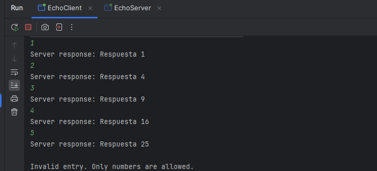

# Ejercicio 4

Escriba un servidor que pueda recibir un número y responda con un operación sobre este número. Este servidor puede recibir un mensaje que empiece por
“fun:”, si recibe este mensaje cambia la operación a las especificada. El servidor
debe responder las funciones seno, coseno y tangente. Por defecto debe empezar
calculando el coseno. Por ejemplo, si el primer n´umero que recibe es 0, debe
responder 1, si después recibe π/2 debe responder 0, si luego recibe “fun:sin”
debe cambiar la operación actual a seno, es decir a a partir de ese momento
debe calcular senos. Si enseguida recibe 0 debe responder 0.

La implementacion se encuentra ubicada en la carpeta de exercise4, para ejecutarla primero debemos hacerlo con la clase EchoServer2 y luego a la clase EchoClient2.

Resultado:
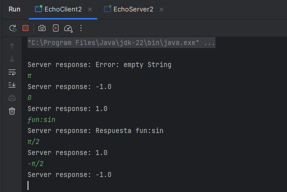

# Ejercicio 5

El código 4 presenta un servidor web que atiende una solicitud. Implemente
el servidor e intente conectarse desde el browser.

La implementacion se encuentra ubicada en la carpeta de exercise5.

Nos conectamos desde un browser:

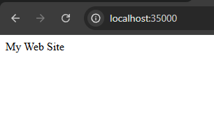

Y vemos el resultado que nos da en la consola:

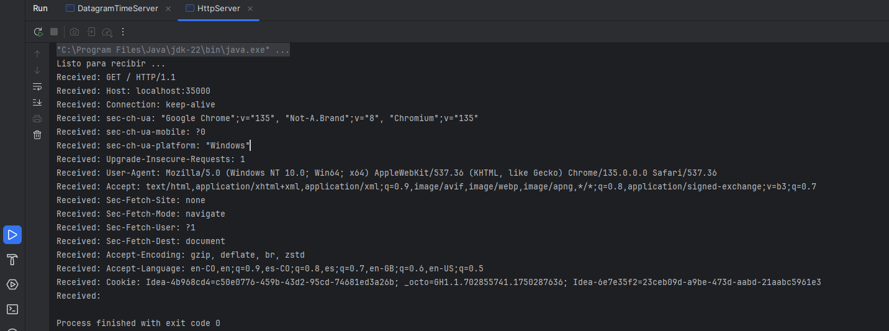

# Ejercicio 6

Escriba un servidor web que soporte múltiples solicitudes seguidas (no concurrentes). El servidor debe retornar todos los archivos solicitados, incluyendo
páginas html e imágenes.

La implementacion se encuentra ubicada en la carpeta de exercise6.

Resultado con una página:

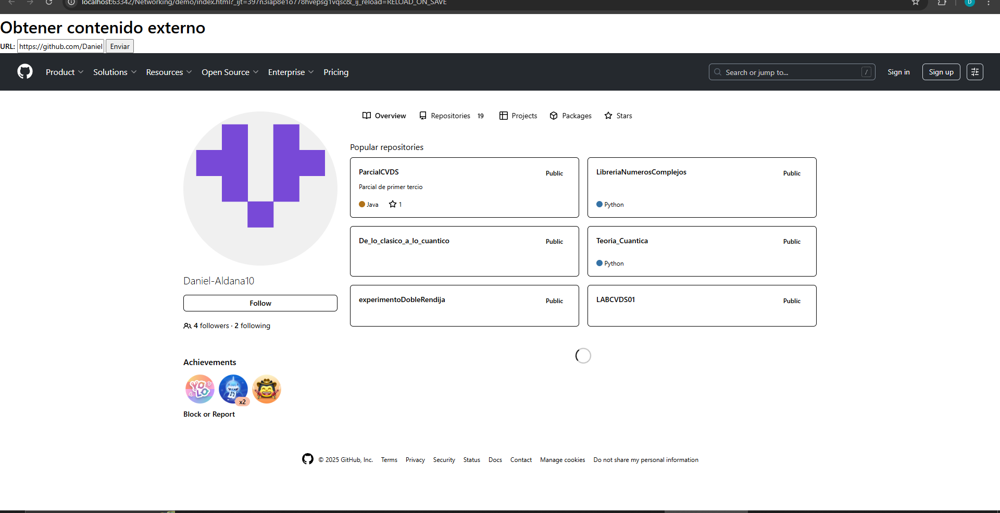

Resultado con una imágen:

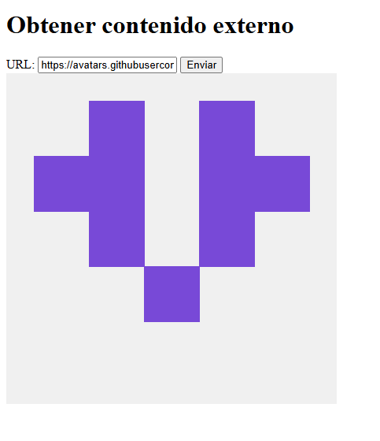

# Ejercicio 7
Utilizando Datagramas escriba un programa que se conecte a un servidor
que responde la hora actual en el servidor. El programa debe actualizar la hora
cada 5 segundos según los datos del servidor. Si una hora no es recibida debe
mantener la hora que tenía. Para la prueba se apagará el servidor y después de
unos segundos se reactivaré. El cliente debe seguir funcionando y actualizarse
cuando el servidor este nuevamente funcionando.

La implementacion se encuentra ubicada en la carpeta de exercise7.

Resultado:

# Ejercicio 8

CHAT: Utilizando RMI, escriba un aplicativo que pueda conectarse a otro
aplicativo del mismo tipo en un servidor remoto para comenzar un chat. El
aplicativo debe solicitar una dirección IP y un puerto antes de conectarse con el
cliente que se desea. Igualmente, debe solicitar un puerto antes de iniciar para
que publique el objeto que recibe los llamados remotos en dicho puerto.

La implementacion se encuentra ubicada en la carpeta de exercise8, para ver su uso en diferentes terminales ejecutamos la clase ChatServerImp.

## Usuario Daniel:

 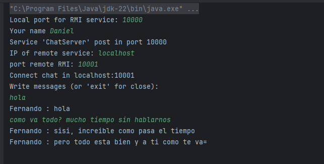

## Usuario Fernando:

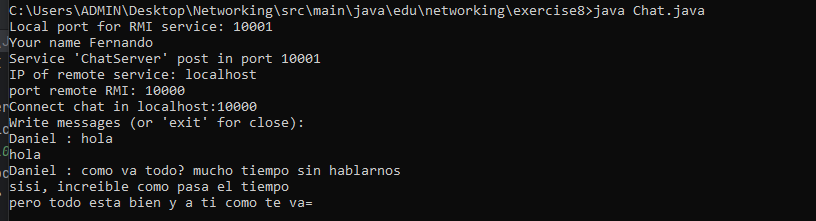

## Autor

* **Daniel Aldana** - [GitHub](https://github.com/Daniel-Aldana10)

## License

Este proyecto está licenciado bajo la licencia MIT: consulte el archivo de LICENCIA para obtener más detalles.